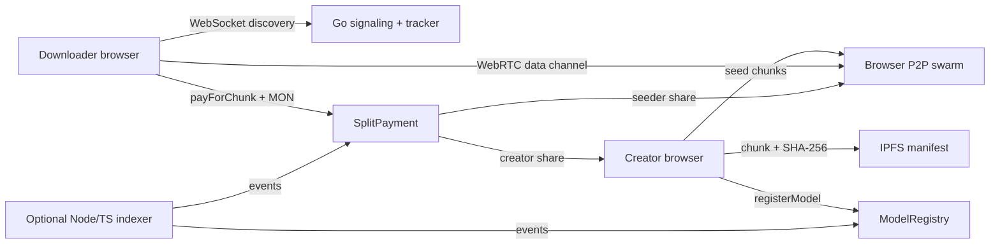

# Torrentia

> **Decentralized P2P AI Model Distribution — Fast, swarm-powered weight streaming with atomic on-chain incentives on Monad.**

Torrentia distributes AI model weights directly between browsers. Creators upload a model, Torrentia chunks and hashes it, pins a lightweight manifest to IPFS, and registers the model on Monad. Downloaders discover peers through a Go signaling tracker, receive chunks over WebRTC, and pay the serving peer per chunk. `SplitPayment.sol` atomically sends the creator royalty and seeder incentive in the same transaction.

**Project category:** decentralized AI infrastructure / DePIN and Web3 AI marketplace. Torrentia uses DeFi-style atomic revenue splitting for peer incentives, but it is not primarily a DeFi protocol.

[](https://testnet.monadscan.com)
[](contracts/)
[](signaling/)
[](frontend/)
[](frontend/src/services/peer-connection.ts)

**Live demo:** configure the Vercel deployment URL here after publishing it.  
**Demo video:** add a Loom or YouTube URL here when recorded.

**Current deployment state:** Monad contracts are deployed on Testnet. The Go signaling service is deployed at `wss://torrentia-signaling.onrender.com/ws`; the frontend is configured for Vercel deployment with the production signaling URL and contract addresses.

## Architecture



## How It Works

1. **Upload and chunk.** The creator selects an `.onnx`, `.safetensors`, `.bin`, or similar model file. The browser streams it into 1 MB chunks and computes a SHA-256 hash for each chunk.
2. **Pin the manifest.** The small `ChunkManifest` JSON is pinned to IPFS. The large model weights remain in the peer swarm rather than on a centralized file host.
3. **Register on Monad.** The creator writes the model ID, IPFS URI, uniform chunk price, chunk count, and creator share to `ModelRegistry.sol`.
4. **Discover seeders.** A downloader connects to the Go WebSocket service and queries which peers hold each model's chunks.
5. **Connect peer-to-peer.** The browsers establish a WebRTC data channel. The Go service only relays SDP/ICE signaling and tracks ephemeral availability.
6. **Request payment.** The downloader requests a chunk. The seeder responds with a `payment-required` message containing the model ID, chunk index, price, and seeder address. This is the WebRTC equivalent of the x402 payment gate.
7. **Split payment atomically.** The downloader calls `SplitPayment.payForChunk(modelId, seederAddress)` with native MON. The contract reads the model terms from `ModelRegistry` and sends both shares in one transaction:

   ```text
   creatorAmount = msg.value * creatorShareBps / 10000
   seederAmount  = msg.value - creatorAmount
   ```

8. **Verify and stream.** The seeder verifies the transaction receipt and `PaymentSplit` event on-chain. Only then does it stream the chunk. The downloader verifies the SHA-256 hash and stores the chunk in IndexedDB.

### Wallet-scoped browser storage

IndexedDB chunks are keyed by both the model ID and connected wallet address. This prevents two wallets using the same browser profile from treating one another's cached chunks as already downloaded. A downloader therefore pays for missing chunks even when another wallet previously cached the same model locally.

## Smart Contracts and Monad

Both contracts are deployed on Monad Testnet, chain ID `10143`.

| Contract | Address | Explorer |
|---|---|---|
| `ModelRegistry` | `0xe2cEDee4817B11716728aed3C3d7AD0438813340` | [View contract](https://testnet.monadscan.com/address/0xe2cEDee4817B11716728aed3C3d7AD0438813340) |
| `SplitPayment` | `0xFF9c3ce76Eba5647a7d22DF9A8b699d91F4bbdDa` | [View contract](https://testnet.monadscan.com/address/0xFF9c3ce76Eba5647a7d22DF9A8b699d91F4bbdDa) |

The payment contract is connected to the registry through its immutable constructor reference. `SplitPayment` reads the creator, price, and split configuration from `ModelRegistry`; the registry does not depend on the payment contract.

Deployment transactions:

- [Deploy `ModelRegistry`](https://testnet.monadscan.com/tx/0xfcd07827ea5ce838ceb65edaa2c9d2d8cfc5ba252ba52d50f3e020c3ce2f51d4)
- [Deploy `SplitPayment`](https://testnet.monadscan.com/tx/0xfac22b8e270a2075775020a6a6f86457774bcf7d100711198ea5ed70a1b86a21)
- [Register demo model](https://testnet.monadscan.com/tx/0x874dd5db24c3243fd57d6d4c68f33481001c74238eb771f8134205353b757282)

Monad-specific considerations:

- Production payment calls should use explicit, tight gas limits because Monad charges based on the gas limit.
- Fast confirmation makes per-chunk native MON settlement practical for a live streaming demo.
- The creator share is set at registration and the chunk price is uniform across all seeders.

The Foundry suite contains **28 passing tests** covering registration validation, deactivation, exact payment amounts, split rounding, events, and multiple sequential payments.

## Honest Status

| Feature | Status | Notes |
|---|---|---|
| Smart contracts | ✅ Deployed and tested | 28 Foundry tests pass; contracts are live on Monad Testnet. |
| Go signaling and tracker | ✅ Implemented and tested | Thread-safe tracker, heartbeat eviction, WebSocket relay, graceful shutdown. |
| Browser WebRTC transfer | ✅ Implemented | Data-channel chunk streaming, backpressure, IndexedDB storage, hash checks. |
| On-chain payment flow | ✅ Wired | Real `payForChunk` calls, receipt confirmation, `PaymentSplit` verification, and Monadscan transaction links. |
| Upload pipeline | ✅ Implemented | Client chunking, SHA-256 hashing, manifest pinning, and registration UI. |
| Split visualization | ✅ Implemented | Live creator/seeder visualization and Monadscan transaction links. |
| Model discovery | ✅ MVP-ready | The frontend reads `ModelRegistered` events directly from Monad in bounded RPC ranges; the Node/TS indexer remains optional. |
| Production hosting | ✅ Configured | Signaling runs on Render and the SPA is configured for Vercel. Live environment variables must be set in the hosting dashboards. |

## Repository Layout

```text
contracts/     Solidity contracts, Foundry tests, deployment scripts
frontend/      React + TypeScript + Vite application
signaling/     Go WebSocket signaling server and seeder tracker
context/       Product, architecture, and implementation specifications
render.yaml    Render service configuration
```

## Local Development

### Prerequisites

- Node.js and npm
- Go 1.27+
- Foundry
- A Monad-compatible browser wallet for live transactions
- Optional: Pinata JWT for IPFS manifest pinning

### Smart contracts

```bash
cd contracts
forge test -vv
forge build
```

The deployed addresses are recorded in [`contracts/deployments/monad-testnet.json`](contracts/deployments/monad-testnet.json). Never commit a deployer private key; use `DEPLOYER_PRIVATE_KEY` only in your local environment when deploying.

### Signaling server

```bash
cd signaling
go test ./...
go vet ./...
go run ./cmd/signaling --port 8081
```

Health check: `http://localhost:8081/health`  
WebSocket endpoint: `ws://localhost:8081/ws`

### Frontend

```bash
cd frontend
npm install
npm run dev
```

Frontend environment variables:

See the root [`.env.example`](.env.example) for the complete deployment variable reference. The frontend-specific file is [`frontend/.env.example`](frontend/.env.example).

```env
VITE_MODEL_REGISTRY_ADDRESS=0xe2cEDee4817B11716728aed3C3d7AD0438813340
VITE_SPLIT_PAYMENT_ADDRESS=0xFF9c3ce76Eba5647a7d22DF9A8b699d91F4bbdDa
VITE_SIGNALING_URL=ws://localhost:8081/ws
VITE_MODEL_REGISTRY_DEPLOYMENT_BLOCK=0x3ce5c19
VITE_PINATA_JWT=your_pinata_jwt
```

### Two-browser demo

1. Start the Go signaling server and frontend, or open the deployed Vercel frontend configured with `wss://torrentia-signaling.onrender.com/ws`.
2. In Browser A, connect a wallet, upload a small model, and start seeding it.
3. In Browser B or a separate browser profile, open the model page and connect a funded Monad Testnet wallet. Wallet-scoped storage means simply switching wallets in the same profile is also safe after the wallet-cache update.
4. Start the download.
5. Approve the per-chunk MON payment.
6. Open the Monadscan transaction link and show the atomic creator/seeder split.
7. Browser B verifies and reassembles the downloaded file, then can start seeding it.

The upload and payment interfaces expose direct Monadscan links for transaction verification. Use a small model with 3–5 chunks for a reliable presentation; each missing chunk requires a separate wallet signature.

For a reliable presentation, use a small model with 3–5 chunks. The registered demo model is useful for verifying the contract event, but its placeholder IPFS URI does not contain browser-seedable model chunks.

## Judge Defense

### Why Monad instead of Ethereum L1?

Torrentia settles a payment per transferred chunk. Fast confirmation and low transaction costs are important because a slow or expensive settlement would interrupt the streaming loop.

### Why not store the weights directly on IPFS?

Torrentia uses IPFS for the lightweight, content-addressed manifest. The large model weights are transferred browser-to-browser through the swarm, reducing dependence on centralized bandwidth hosting.

### Can a seeder set an arbitrary price?

No. The model's uniform chunk price is stored in `ModelRegistry`. The downloader checks the payment challenge, and `SplitPayment` reverts unless `msg.value` exactly matches the registered price.

### What happens if a seeder fails after payment?

The downloader's loss is limited to the individual chunk payment. The client can abandon that peer and request the chunk from another active seeder. A production version could add stronger dispute or delivery guarantees, but those are outside the MVP scope.

### Is Torrentia a piracy-prevention system?

No. Out-of-band sharing is outside the scope. Torrentia focuses on decentralized distribution and aligning creator royalties with peer bandwidth contribution.

## Scope Boundaries

Torrentia's MVP intentionally does not include staking, reputation scores, DAO governance, dynamic or per-seeder pricing, escrow, or centralized model hosting. The chain is the source of truth for model terms and payment events; the Go tracker is ephemeral availability coordination only.
