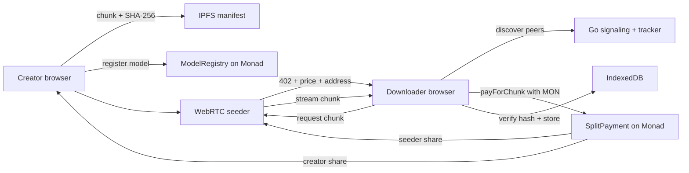

# Torrentia

> Decentralized, verifiable delivery for open-source AI — rewarding creators and community hosts with on-chain micro-payments on Monad.

[](https://testnet.monadscan.com/)
[](https://soliditylang.org/)
[](https://vite.dev/)
[](https://go.dev/)
[](https://developer.mozilla.org/en-US/docs/Web/API/WebRTC_API)
[](#license)

Torrentia is a peer-to-peer marketplace and delivery network for open-source AI model weights. A creator uploads a model, Torrentia chunks and hashes it in the browser, stores a lightweight manifest on IPFS, and registers the model on Monad. Downloaders discover peers through the signaling service and receive chunks directly over WebRTC. Each chunk payment is settled atomically between the original creator and the seeder serving the data.

The result is a distribution model in which demand adds swarm capacity instead of making the creator carry all bandwidth costs.

## Links

- **Live app:** [torrentia.vercel.app](https://torrentia.vercel.app)
- **Signaling service:** `wss://torrentia-signaling.onrender.com/ws`
- **Hackathon submission:** [SUBMISSION.md](SUBMISSION.md)
- **Project context and specifications:** [context/](context/)

Torrentia currently targets **Monad Testnet** (chain ID `10143`). It is an experimental testnet application; do not use production funds.

## Why Torrentia

Torrentia focuses on two infrastructure problems:

1. **Scaling cost:** popular models create recurring centralized bandwidth and hosting costs.
2. **Control:** a centralized host can throttle or remove a model.

Torrentia addresses these with content-addressed chunks, browser-to-browser transfer, and an immutable on-chain payment rule. Torrentia does not claim to control or prevent out-of-band file sharing.

## How it works


```mermaid
flowchart LR
    C[Creator browser] -->|chunk + SHA-256| M[IPFS manifest]
    C -->|register model| R[ModelRegistry on Monad]
    C --> S[WebRTC seeder]
    D[Downloader browser] -->|discover peers| T[Go signaling + tracker]
    D -->|request chunk| S
    S -->|402 + price + address| D
    D -->|payForChunk with MON| P[SplitPayment on Monad]
    P -->|creator share| C
    P -->|seeder share| S
    S -->|stream chunk| D
    D -->|verify hash + store| I[IndexedDB]
```

1. **Upload:** the browser splits a model into 1 MiB chunks, computes SHA-256 hashes, pins a `ChunkManifest` to IPFS, and registers the model.
2. **Discovery:** the downloader connects to the Go WebSocket service and finds peers advertising chunks for the model.
3. **Transfer:** the peers establish a WebRTC data channel. The seeder remains responsible for delivering the requested chunk.
4. **Payment gate:** the seeder returns a `402 Payment Required` challenge containing the model, chunk, uniform price, and seeder address.
5. **Atomic settlement:** the downloader calls `SplitPayment.payForChunk(modelId, seederAddress)` with native MON. The contract splits the payment in one transaction.
6. **Verification:** after receipt verification, the seeder sends the chunk. The downloader verifies its hash, stores it in IndexedDB, and reassembles the model when all chunks arrive.

The creator share is configured in basis points at registration. With `creatorShareBps = 7000`, the creator receives 70% and the seeder receives 30% of every valid chunk payment.

## Monad testnet contracts

| Contract | Address | Explorer |
|---|---|---|
| `ModelRegistry` | `0xe2cEDee4817B11716728aed3C3d7AD0438813340` | [View on Monadscan](https://testnet.monadscan.com/address/0xe2cEDee4817B11716728aed3C3d7AD0438813340) |
| `SplitPayment` | `0xFF9c3ce76Eba5647a7d22DF9A8b699d91F4bbdDa` | [View on Monadscan](https://testnet.monadscan.com/address/0xFF9c3ce76Eba5647a7d22DF9A8b699d91F4bbdDa) |

The contracts are intended for Monad Testnet. Verify the active addresses against the deployment configuration before deploying a new frontend build.

## Current status

| Area | Status | Notes |
|---|---|---|
| Smart contracts | Implemented | `ModelRegistry`, `SplitPayment`, deployment scripts, and Foundry tests are present. |
| Upload pipeline | Implemented | Browser chunking/hashing, manifest pinning, and registration flow are present. |
| WebRTC transfer | Implemented | Signaling, peer transfer, backpressure, hash verification, and IndexedDB storage are present. |
| Go signaling/tracker | Implemented | WebSocket relay, seeder tracking, heartbeats, health endpoint, and graceful shutdown are present. |
| Frontend marketplace | Implemented | Marketplace, model detail, upload, dashboard, download, and split visualization routes are present. |
| Indexing | Available | The `indexer/` service uses Envio HyperIndex for contract-event indexing and GraphQL access. |
| Production hardening | In progress | Testnet deployment, service observability, abuse handling, and operational guarantees still require environment-specific validation. |

## Repository layout

```text
torrentia/
├── contracts/          # Foundry project: Solidity contracts, tests, and scripts
├── frontend/           # React + TypeScript + Vite application
├── signaling/          # Go WebSocket signaling, tracker, broker, and seeder services
├── indexer/             # Envio HyperIndex configuration and event handlers
├── deploy/              # Deployment and infrastructure configuration
├── scripts/             # Local tooling and seeder installation helpers
├── context/             # Architecture, product, UI, and implementation specifications
├── assets/              # Documentation and product assets
├── SUBMISSION.md        # Hackathon tracks and implementation summary
└── README.md
```

## Prerequisites

- Node.js compatible with the frontend toolchain
- npm
- Go `1.27.0` or a compatible newer Go release
- Foundry (`forge`, `cast`, and `anvil`) for contract work
- Docker, if running the local Envio stack or CLI seeder container
- A Monad Testnet wallet funded with testnet MON for on-chain flows
- A Pinata JWT for upload-broker deployments that pin manifests

## Quick start

### 1. Run contract tests

```bash
cd contracts
forge test
```

For verbose traces:

```bash
forge test -vvv
```

### 2. Run the signaling service

```bash
cd signaling
go test ./...
go run ./cmd/signaling --port 8081
```

The local service exposes WebSocket signaling at `ws://localhost:8081/ws` and health information at `http://localhost:8081/health`.

The repository also contains separate commands for the upload broker, persistent seeder, and gateway. Run `go run ./cmd/<command> --help` from `signaling` for command-specific options.

### 3. Run the frontend

```bash
cd frontend
npm install
npm run dev
```

Create `frontend/.env.local` with values appropriate for your environment:

```env
VITE_MODEL_REGISTRY_ADDRESS=0xe2cEDee4817B11716728aed3C3d7AD0438813340
VITE_SPLIT_PAYMENT_ADDRESS=0xFF9c3ce76Eba5647a7d22DF9A8b699d91F4bbdDa
VITE_SIGNALING_URL=ws://localhost:8081/ws
VITE_UPLOAD_BROKER_URL=http://localhost:8082
```

For the hosted testnet services, use:

```env
VITE_SIGNALING_URL=wss://torrentia-signaling.onrender.com/ws
VITE_UPLOAD_BROKER_URL=https://torrentia-upload-broker.onrender.com
```

Never expose `PINATA_JWT`, deployer private keys, or other server credentials through a `VITE_*` variable. Vite variables are bundled into the browser application.

### 4. Run the indexer (optional)

```bash
cd indexer
npm install
npm run codegen
npm run dev
```

The indexer is optional for the core contract and peer-transfer flows, but it supplies event-backed marketplace and dashboard data when configured.

## Local demo flow

1. Open the frontend in two browser tabs.
2. Connect a Monad Testnet wallet in the first tab.
3. Upload a small model and keep the first tab seeding.
4. Open the model detail page in the second tab.
5. Start a download and observe peer discovery, chunk progress, hash verification, and the creator/seeder split visualization.
6. Follow the Monadscan transaction links to inspect the on-chain settlement.

Use small test files first. Large model transfers require suitable browser memory, IndexedDB capacity, network connectivity, and a configured upload broker/IPFS pinning service.

## Engineering invariants

These rules are part of the product design and should be preserved in every change:

- **Uniform chunk price:** a chunk costs the same regardless of which seeder serves it.
- **Atomic split:** creator and seeder settlement happens in one transaction.
- **Immutable creator:** the registered `originalCreator` cannot be reassigned.
- **Content-addressed transfer:** every received chunk is verified against its manifest hash.
- **No central model host:** model data is transferred through the peer swarm; IPFS stores the manifest.
- **Clear boundaries:** Go owns signaling/tracking, the indexer owns event indexing, and the frontend owns wallet, contract, IPFS, chunking, WebRTC, and UI logic.

Do not introduce per-seeder pricing, staking, reputation, DAO governance, speculative tokenomics, or piracy-prevention claims without an explicit product decision and corresponding specification update.

## Development commands

```bash
# Frontend
cd frontend
npm run build
npm run lint

# Signaling and Go services
cd signaling
go test ./...

# Indexer
cd indexer
npm run codegen
npm run test
```

Before submitting a change, run the relevant test suite and verify that the frontend production build succeeds.

## Security and operational notes

- Use a dedicated testnet wallet for local development.
- Keep deployer keys and Pinata credentials outside source control.
- Treat browser wallet/session storage, IPFS gateways, signaling availability, and testnet RPCs as environment-dependent services.
- Validate payment receipts and event fields server-side or in the peer protocol before releasing chunks.
- Do not represent testnet behavior, demo throughput, or service uptime as a production guarantee.

## Documentation

- [Product map](context/specs/00-product-map.md)
- [Architecture context](context/architecture-context.md)
- [Code standards](context/code-standards.md)
- [Deployment and DevOps specification](context/specs/16-deployment-and-devops.md)
- [Persistent CLI seeder specification](context/specs/17-persistent-cli-seeder.md)
- [Hackathon submission](SUBMISSION.md)

## Contributing

1. Read the relevant document in `context/` before changing an architectural boundary.
2. Keep changes scoped to the owning component.
3. Add or update tests for contract, protocol, or state-machine behavior.
4. Run the applicable build and test commands.
5. Document new environment variables and operational assumptions.

## License

Torrentia is released under the [MIT License](LICENSE).
