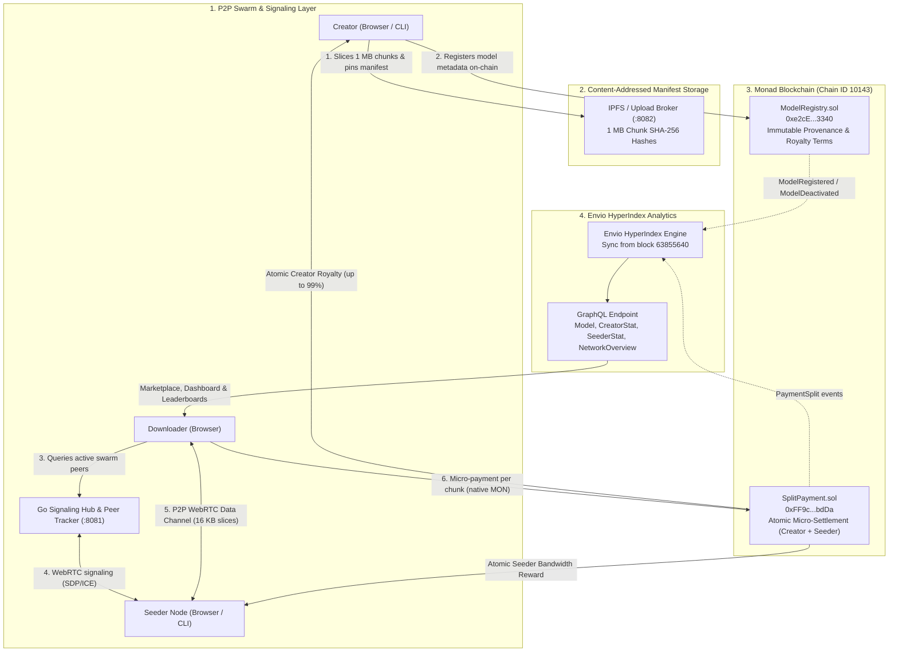

# Torrentia — Hackathon Submission

> **Decentralized, verifiable delivery for open-source AI — rewarding creators and community hosts with sub-second micro-payments on Monad.**

---

## Submission Summary

| Field | Detail |
|---|---|
| **Project Name** | **Torrentia** |
| **Primary Track** | **Trust, Identity & AI Infrastructure ($30,000)** |
| **Target Bounty** | **Best Use of Envio ($2,500)** |
| **Target Network** | **Monad Testnet (Chain ID `10143`)** |
| **Live Frontend** | [torrentia.vercel.app](https://torrentia.vercel.app) |
| **GitHub Repository** | [github.com/tyraakj/torrentia](https://github.com/tyraakj/torrentia) |
| **Signaling Server** | `wss://torrentia-signaling.onrender.com/ws` |
| **Envio HyperIndex** | Configured for Monad Testnet (`indexer/`) |
| **Wallet Support** | MetaMask, Rabby, and standard EIP-1193 browser wallets |

---

## 1. Track Alignment: Trust, Identity & AI Infrastructure

### The Core Problem
Open-source AI has a fundamental distribution and provenance bottleneck:
- **Centralized Infrastructure Capture:** Today, distribution of multi-gigabyte model weights (e.g., Llama, Whisper, Mistral) relies almost entirely on centralized cloud hosts like HuggingFace or AWS S3. A single provider outage, corporate policy shift, or platform de-listing halts global access to critical open-source intelligence.
- **Bandwidth Costs & Creator Disincentives:** Egress bandwidth for multi-gigabyte models costs millions. Model creators receive zero automated compensation when third parties download their weights.
- **Lack of Cryptographic Provenance:** Centralized CDNs can modify or swap model files without user detection. Downloaders have no protocol-level guarantee that the weights downloaded match the creator's exact original artifacts.

### The Torrentia Solution
Torrentia builds the **trust, provenance, and data ownership layer** for AI model distribution:
1. **Protocol-Level Data Provenance:**
   - Model weights are sliced into deterministic 1 MB chunks and hashed with cryptographic SHA-256.
   - An immutable chunk manifest is content-addressed and registered on Monad via `ModelRegistry.sol`.
   - Downloaders verify every chunk cryptographically *before* writing it to disk. Altered or malicious chunks are rejected at the byte level.
2. **Immutable Creator Attribution & Perpetual Royalties:**
   - When a model is registered on-chain, creator ownership and royalty basis points (up to 99%) are locked into Monad smart contract storage.
   - Centralized platforms cannot revoke, alter, or censor the creator's provenance.
3. **Incentivized Swarm Delivery (Monad-Native Micro-Settlement):**
   - Independent bandwidth providers (seeders) deliver chunks directly to downloaders over peer-to-peer WebRTC data channels.
   - Downloaders pay a micro-fee per chunk in native MON. `SplitPayment.sol` atomically splits the payment in real time: the creator receives their royalty, and the seeder receives their bandwidth compensation in a single sub-second transaction.
4. **Anti-Platform Capture:**
   - No single entity controls the network or hosts the weights. As demand for a model grows, the swarm expands organically.

### Why Monad Is Essential
- **High-Throughput Micro-Settlement:** Chunk streaming requires fast, inexpensive micro-transactions. Ethereum L1 gas ($5–$25 per transaction) makes per-chunk payments impossible. Monad's **sub-second block times** and **<$0.001 gas fees** make continuous, real-time chunk settlement economically and technically viable.
- **Parallel Execution Optimization:** Payments in `SplitPayment.sol` read immutable registry data and transfer native MON between disjoint downloader, seeder, and creator accounts without shared state contention, maximizing Monad's parallel execution engine efficiency.

---

## 2. Bounty Alignment: Best Use of Envio ($2,500)

Torrentia relies on **Envio HyperIndex** to process high-frequency on-chain events and power the real-time application layer.

- **Depth of Use:**
  - Non-trivial relational GraphQL schema (`indexer/schema.graphql`) with 5 core entities:
    - `Model`: On-chain parameters, metadata URI, chunk price, and real-time accumulators (`totalPaidChunks`, `totalVolumeMon`, `totalCreatorEarningsMon`, `totalSeederEarningsMon`, `uniqueSeedersCount`).
    - `PaymentSplitEvent`: Immutable audit log of every micro-payment with `@derivedFrom` relationship to `Model`.
    - `CreatorStat`: Aggregated creator performance (models registered, active count, cumulative royalties, chunks delivered).
    - `SeederStat`: Bandwidth provider metrics (chunks served, total MON earned, unique models served, last active timestamp).
    - `NetworkOverview`: Singleton entity tracking global health (total volume, payment count, active models, unique creators/seeders).
- **HyperSync Speed Advantage:**
  - Configured with `start_block: 63855640` on Monad Testnet, skipping over 63 million empty blocks to achieve near-instant initial synchronization.
- **Production Integration:**
  - Replaces fragile direct RPC `eth_getLogs` polling (which triggers HTTP 413 / 429 errors on public nodes) with sub-second GraphQL queries powering the Marketplace stats, Creator Dashboard, and Seeder Leaderboard.
- *Detailed technical report available at [`docs/envio-bounty.md`](docs/envio-bounty.md).*

---

## 3. Architecture & Technical Components

### Component Breakdown
1. **Smart Contracts (`contracts/`):**
   - Solidity 0.8.24 contracts with ReentrancyGuard and SafeTransferLib.
   - Comprehensive Foundry test suite: 28/28 unit tests passing (100% pass rate).
   - Deployed and verified on Monad Testnet.
2. **WebRTC P2P Transfer Engine (`frontend/src/services/`):**
   - Browser-native data channels with 16 KB slice segmentation and 1 MB `bufferedAmount` backpressure control.
   - Streaming SHA-256 integrity verification via Web Workers.
   - Local chunk caching in browser IndexedDB.
3. **Go Signaling Server & Tracker (`signaling/`):**
   - High-concurrency WebSocket hub written in Go (`gorilla/websocket`).
   - Thread-safe peer discovery and automatic 30s heartbeat timeout eviction.
   - Deployed live on Render.
4. **Persistent CLI Seeder (`signaling/cmd/seeder/`):**
   - Standalone Go binary (`torrentia-seeder`) for headless node operators and data centers.
   - NVMe directory mounting, autonomous heartbeat, and Monad RPC payment verification.
5. **Upload Broker Microservice (`signaling/cmd/broker/`):**
   - Eliminates client-side IPFS credential exposure by validating EIP-712 upload intents signed by the creator's wallet.

---

## 4. Deployed Smart Contracts (Monad Testnet)

| Contract | Address | Transaction Hash | Explorer |
|---|---|---|---|
| **ModelRegistry** | `0xe2cEDee4817B11716728aed3C3d7AD0438813340` | `0xfcd07827ea5ce838ceb65edaa2c9d2d8cfc5ba252ba52d50f3e020c3ce2f51d4` | [Monadscan ↗](https://testnet.monadscan.com/address/0xe2cEDee4817B11716728aed3C3d7AD0438813340) |
| **SplitPayment** | `0xFF9c3ce76Eba5647a7d22DF9A8b699d91F4bbdDa` | `0xfac22b8e270a2075775020a6a6f86457774bcf7d100711198ea5ed70a1b86a21` | [Monadscan ↗](https://testnet.monadscan.com/address/0xFF9c3ce76Eba5647a7d22DF9A8b699d91F4bbdDa) |
| **SplitPaymentV2** | `0xe2aD791258862F628af1b8B5104532F3BceE5ECe` | `0x0b9941f9485724628dd9c63fdaf4e7e4b6374f877a618a833b456d6920dc196f` | [Monadscan ↗](https://testnet.monadscan.com/address/0xe2aD791258862F628af1b8B5104532F3BceE5ECe) |

---

## 5. Verification & Testing Evidence

- **Foundry Unit Tests:**
  - Contracts pass 28/28 unit tests covering registry operations, royalty basis point calculations, atomic split transfers, and reentrancy protections.
- **Go Signaling & Seeder Tests:**
  - 11/11 Go unit and end-to-end integration tests pass for the tracker and CLI seeder.
  - 12/12 Go unit tests pass for EIP-712 broker intent validation.
- **Frontend Quality Assurance:**
  - Strict TypeScript configuration with 0 compile errors (`tsc -b`).
  - Pre-commit mechanical suppression check (`scripts/check-suppressions.sh`) verifies zero unapproved `@ts-ignore`, `eslint-disable`, or `as any` suppressions.

---

## 6. How to Test the Project

1. **Visit the Web App:** Navigate to [torrentia.vercel.app](https://torrentia.vercel.app).
2. **Connect Wallet:** Connect MetaMask or Rabby set to **Monad Testnet** (Chain ID `10143`).
   - Get testnet MON from [faucet.monad.xyz](https://faucet.monad.xyz).
3. **Explore Marketplace:** View models indexed via Envio. Notice real-time seeder availability and creator royalty parameters.
4. **Download from Swarm:**
   - Select a model (e.g., MobileNet v2 ONNX).
   - Click "Download from Swarm".
   - The browser connects to active seeders via WebRTC, initiates chunk transfers, verifies SHA-256 hashes in real time, and settles atomic split payments on Monad.
5. **Headless Seeding (Optional):**
   - Run `torrentia-seeder.exe` locally to provide persistent upstream bandwidth and earn real MON rewards.
